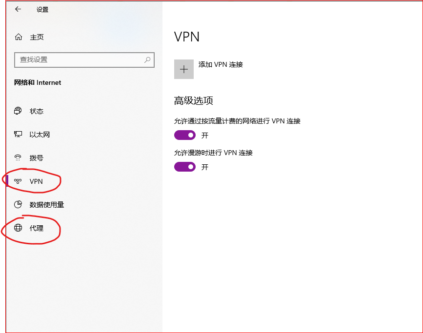
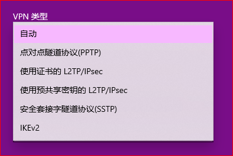
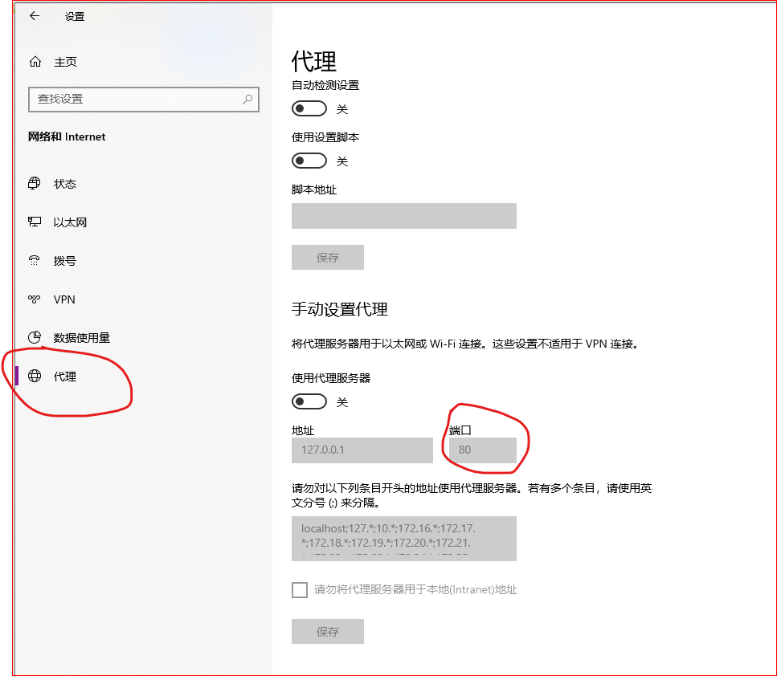
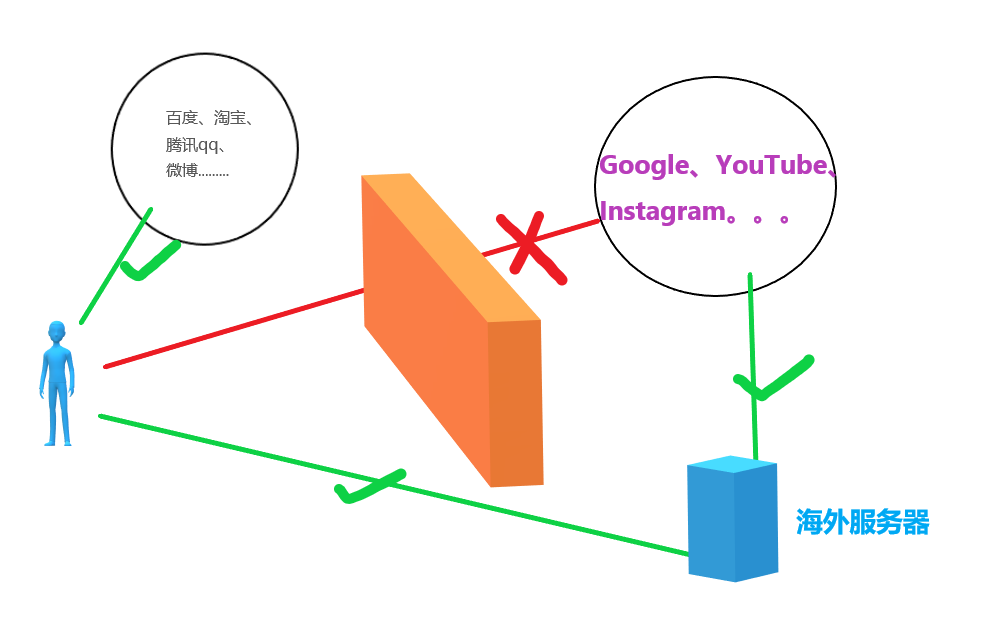

## 如何访问国外网站，怎么上Google谷歌查资料，怎么看youtube？为小白提供思路

&nbsp;

对于刚接触的小白来说，一头雾水，不知道从何下手。

授人以鱼不如授人以渔，我主要讲思路。

&nbsp;

### 工具的类型

想要访问国外网站，**主要工具分两类，VPN和代理。**（隐晦一点的名字有梯子、加速器等）。现在见到的大部分工具都是代理类型的。

在WIN10里可以很清楚的看到这两类：

它们的原理差不多，但是实现方法不同。

容易看见的区别：

> 1、协议不同。2、VPN不需要设置端口，代理需要。3、VPN对整个电脑生效，代理对一部分软件生效。

&nbsp;

### 思路与选择

- 其实，VPN是用来远程办公的，如果使用它去访问国外网站，有点偏离正轨的味道。**不建议用V**，还有一个原因，那就是V的特征太明显，很容易被识别。而且那些知名的服务商，既然知名，肯定会被我们的防火墙特别关照。不信 网上搜搜 express Nord 退款。。。这还是比较有实力的服务商了，虽然断断续续能用，但是经常断，经常要联系客服，手动调整，让人很心烦。。。

- 至于“机场”，**是个不错的选择**，主要因为便宜，而且节点多，特别适合“随便用用的人”。但是缺点是用的人多，情况复杂，速度不稳，容易被封，所以要买那种月付的，减少损失。当然，如果能找到比较优质的，体验也会不错，不要嫌麻烦，多找找，找名声好点的。（机场不是工具名，可以理解为卖工具的商家）

> 从我的经验来看，现在想要找到什么好用又稳定的工具，很难，**难在稳定。**

- **最好的选择**：建议自己搭建各种开源软件，私人用，风险小。在开源社区Github上用关键词搜索找软件，种类有很多，各有优缺点。教程的话，网上也很多，可以先用免费的工具上Google，然后很容易就能找到教程。

其中，**最重要的就是购买云服务器**，这关系到网速的好坏和稳定性。需要准备一张信用卡或者PayPal，因为稍大一点的主流的服务商就只支持这样的支付方式，只有一小部分是支持支付宝的。价格的话，稍微好一点是5-10美元每月，可以舒服的看视频。。我搭建的这个，看YouTube1080p的视频很轻松，也挺省心的，用了差不多两年了。。
    
还有一点，访问国外网站的速度也和自己的网络状况  有很大关系，比如你所在的省份，所使用的宽带等等。沿海地区的 速度会快一些，电信、联通的宽带会快一些，移动的宽带就稍差一些。。

&nbsp;

如果是小白，肯定不会很顺利，不要着急，这是一个慢慢摸索的过程。。

&nbsp;

> 我的知乎：[daoying](https://www.zhihu.com/people/daoyingdaoying)
